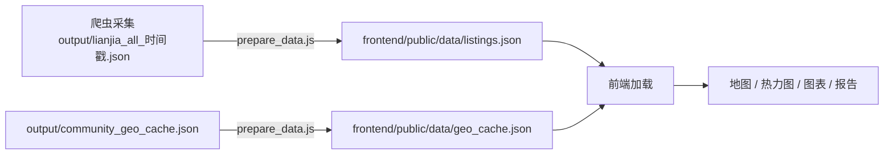

# 租房雷达 RentRadar

上海租房市场数据采集与可视化分析工具，聚焦浦东区域（张江、金桥、唐镇、川沙）及长宁区。通过 Playwright 浏览器自动化采集链家租房数据，结合腾讯位置服务 API 生成通勤距离单价地图，并提供 React 交互式前端看板。

## 功能概览

- **多区域爬取** — 张江、金桥、唐镇、川沙、长宁 5 个区域，自动检测子区域下钻，支持断点续爬
- **反检测机制** — 模拟人类滚动/鼠标移动、动态延迟、浏览器指纹伪装
- **验证码自动处理** — 集成超级鹰自动识别极验验证码，失败后通知手动处理
- **数据分析** — 8 张统计图表 + 控制台摘要报告
- **地图生成** — 高清 PNG 静态图 + HTML 交互地图，按距离分层展示小区单价
- **前端看板** — React + Ant Design + ECharts + Leaflet 交互式可视化，含热力图、距离环排名、分析报告
- **CI/CD** — GitHub Actions 自动部署到 GitHub Pages
- **后端代理服务** — 独立 Flask 服务代理腾讯地图 API，支持 Docker 一键部署

## 快速开始

### 环境要求

- Python 3.10
- Node.js 20+
- macOS（浏览器模式需要系统 Chrome）

### 安装依赖

```bash
# Python 依赖
python3.10 -m pip install playwright matplotlib folium adjustText
python3.10 -m playwright install chromium

# 可选: AI Agent 模式
python3.10 -m pip install browser-use langchain-openai

# 前端依赖
cd frontend && npm install
```

### 配置 API 密钥

```bash
cp .env.example .env
```

编辑 `.env` 填入：

```
TENCENT_MAP_KEY=你的密钥        # 腾讯位置服务（地图坐标，不配则无坐标）
TENCENT_MAP_SK=你的签名密钥
CHAOJIYING_USER=超级鹰账号      # 验证码识别（可选）
CHAOJIYING_PASS=超级鹰密码
CHAOJIYING_SOFT_ID=软件ID
```

- 腾讯位置服务：[lbs.qq.com](https://lbs.qq.com/)
- 超级鹰验证码：[chaojiying.com](https://www.chaojiying.com/)

### 常用命令

```bash
# 完整流程：爬取 + 分析 + 生成地图
python3.10 -m scraper.pipeline --areas all --workplace 张江国创

# 仅爬取指定区域（从头开始）
python3.10 -m scraper.pipeline --areas zhangjiang,jinqiao --fresh

# 合并已有断点数据 + 生成地图（不触发爬取）
python3.10 -m scraper.pipeline --merge

# 仅生成地图（使用已有数据）
python3.10 -m scraper.pipeline --skip-scrape --workplace 金桥

# 刷新地理位置缓存（重查 hash 伪坐标和 miss 条目）
python3.10 -m scraper.pipeline --refresh-geo --skip-scrape --skip-map

# 分析指定 JSON 文件
python3.10 -m scraper.pipeline --analyze output/lianjia_all_xxx.json
```

### 启动前端看板

```bash
cd frontend
npm run dev
```

`npm run dev` 会自动执行数据准备脚本（从 `output/` 取最新数据复制到 `frontend/public/data/`），然后启动 Vite 开发服务器。打开 http://localhost:5173 查看看板。

## 项目结构

```
lianjia/
├── scraper/                       # Python 爬虫 + 分析 + 地图
│   ├── config.py                  #   配置常量（区域、工作地点、颜色）
│   ├── pipeline.py                #   流水线编排（CLI 解析 + 爬取→保存→分析→地图）
│   ├── scraper_core.py            #   爬取引擎（Playwright + 子区域检测 + 断点续爬）
│   ├── browser_helpers.py         #   浏览器上下文、人类行为模拟、子区域提取 JS
│   ├── captcha.py                 #   验证码自动识别（GeeTest v4 + 超级鹰）
│   ├── storage.py                 #   数据持久化（JSON/CSV、断点文件、合并聚合）
│   ├── geo.py                     #   地理编码（腾讯 API + 本地缓存 + hash 伪坐标清理）
│   ├── map_generator.py           #   地图生成（PNG 静态图 + Leaflet HTML）
│   ├── analyzer.py                #   数据分析（8 张 matplotlib 图表）
│   ├── retry.py                   #   重试机制与错误日志
│   └── utils.py                   #   工具函数（日志、去重、通知、URL 生成）
├── frontend/                      # React 前端可视化
│   ├── src/
│   │   ├── App.jsx                #   主布局（数据加载 + 标签页导航）
│   │   ├── components/
│   │   │   ├── CommunityMap.jsx       # Leaflet 地图（高德底图 + 距离环 + 小区标注）
│   │   │   ├── HeatmapCanvas.jsx      # Canvas 热力图渲染
│   │   │   ├── OverviewCards.jsx      # 总览卡片（房源数、均价、单价）
│   │   │   ├── AnalysisReport.jsx     # 综合分析报告
│   │   │   ├── DistanceTable.jsx      # 距离分层表格
│   │   │   ├── TopByRing.jsx          # 各距离环热门小区排名
│   │   │   ├── CommunityListings.jsx  # 小区房源明细列表
│   │   │   ├── PriceBoxPlot.jsx       # 各区域价格箱线图
│   │   │   ├── PriceHistogram.jsx     # 价格直方图
│   │   │   ├── RoomsBarChart.jsx      # 户型分布柱状图
│   │   │   ├── AvgAreaBar.jsx         # 各区域平均面积
│   │   │   ├── TopCommunities.jsx     # 热门小区排行
│   │   │   ├── RentTypePie.jsx        # 租赁类型饼图
│   │   │   ├── PriceVsArea.jsx        # 价格 vs 面积散点图
│   │   │   ├── DirectionBar.jsx       # 朝向分布
│   │   │   ├── WorkplaceSelector.jsx  # 工作地点选择器（支持自定义坐标）
│   │   │   └── AdSlot.jsx             # 广告位组件
│   │   └── utils/
│   │       ├── constants.js           # 前端常量（区域、工作地点、颜色）
│   │       ├── haversine.js           # Haversine 距离计算
│   │       ├── stats.js               # 统计聚合与距离筛选
│   │       └── analysis.js            # 数据分析辅助函数
│   ├── public/data/                   # 静态数据文件（自动生成）
│   ├── vite.config.js                 # Vite 配置（含腾讯地图 API 代理）
│   └── package.json
├── server/                              # 后端代理服务（生产环境）
│   ├── app.py                          #   Flask 代理（CORS + 缓存）
│   ├── requirements.txt                #   Python 依赖
│   └── Dockerfile                      #   容器化部署
├── scripts/
│   ├── prepare_data.js                # 数据准备（复制最新数据到前端）
│   ├── deploy.sh                      # GitHub Pages 部署脚本
│   └── deploy-server.sh               # 后端服务一键部署脚本
├── .github/workflows/deploy.yml       # GitHub Actions CI/CD
├── .env                               # API 密钥（不入库）
├── .env.example                       # API 密钥模板
├── requirements.txt                   # Python 依赖
└── output/                            # 输出目录（数据、地图、图表、日志）
```

## 操作手册

### 爬虫参数

| 参数 | 默认值 | 说明 |
|------|--------|------|
| `--areas` | `all` | 爬取区域：`all` 或逗号分隔（如 `zhangjiang,jinqiao`） |
| `--max-pages` | `100` | 每区域最大页数 |
| `--mode` | `browser` | 爬取模式：`browser`（浏览器）或 `agent`（AI） |
| `--format` | `both` | 输出格式：`json` / `csv` / `both` |
| `--model` | `gpt-4o` | Agent 模式使用的 LLM |
| `--fresh` | — | 清除断点数据，从头爬取 |

### 地图参数

| 参数 | 默认值 | 说明 |
|------|--------|------|
| `--workplace` | `张江国创` | 工作地点：中文名 / 拼音 key / 经纬度坐标 |
| `--max-distance` | `15` | 最大距离（km） |
| `--max-labels` | `200` | 图片标注小区数，0=全部 |

### 控制参数

| 参数 | 说明 |
|------|------|
| `--skip-scrape` | 跳过爬取步骤 |
| `--skip-map` | 跳过地图生成 |
| `--merge` | 聚合所有 partial 断点文件为合并 JSON/CSV（隐含 `--skip-scrape`） |
| `--refresh-geo` | 刷新地理位置缓存（重查 hash 伪坐标和 miss 条目） |
| `--refresh-geo-force` | 强制重查所有坐标（包括已有 API 结果的） |
| `--data` | 指定数据文件（默认自动查找最新的） |
| `--analyze` | 仅分析模式：指定 JSON 文件路径 |

### 支持区域

| slug | 中文名 |
|------|--------|
| `zhangjiang` | 张江 |
| `jinqiao` | 金桥 |
| `tangzhen` | 唐镇 |
| `chuansha` | 川沙 |
| `changning` | 长宁 |

### 预定义工作地点

| 名称 | 拼音 key | 地址 |
|------|----------|------|
| 张江国创中心 | `zhangjiang` | 丹桂路899号 |
| 张江国创二期 | `zhangjiang_2` | 张江国创中心二期 |
| 金桥开发区 | `jinqiao` | 金桥经济技术开发区 |
| 唐镇 | `tangzhen` | 唐镇中心 |
| 川沙 | `chuansha` | 川沙新镇 |

支持中文模糊匹配（如输入"张江"匹配"张江国创中心"），也支持直接传入经纬度：`--workplace "31.22,121.54"`

### 输出文件

```
output/
├── lianjia_all_20260423_143000.json          # 全区域合并数据
├── lianjia_all_20260423_143000.csv           # CSV 格式
├── lianjia_*_*.partial.json                  # 各区域/子区域断点文件
├── community_geo_cache.json                  # 地理编码缓存
├── community_map_张江国创中心_*.png           # 高清静态地图（5600x4400）
├── community_map_张江国创中心_*.html          # 交互式 HTML 地图
├── scraper.log                               # 运行日志
└── charts/
    ├── 1_price_by_region.png                 # 各区域价格箱线图
    ├── 2_price_histogram.png                 # 整体价格直方图
    ├── 3_rooms_by_region.png                 # 户型分布
    ├── 4_avg_area_by_region.png              # 各区域平均面积
    ├── 5_top_communities.png                 # 热门小区 TOP15
    ├── 6_rent_type_pie.png                   # 租赁类型饼图
    ├── 7_price_vs_area.png                   # 价格 vs 面积散点图
    └── 8_direction_by_region.png             # 朝向分布
```

### 数据字段

| 字段 | 说明 |
|------|------|
| `region` | 区域 slug |
| `title` | 房源标题 |
| `rent_type` | 租赁类型（整租/合租等） |
| `community` | 小区名称 |
| `location` | 位置（如 `浦东-张江-某某小区`） |
| `area` | 面积（㎡） |
| `rooms` | 户型（如 2室1厅） |
| `direction` | 朝向 |
| `floor` | 楼层信息 |
| `price` | 月租金（元） |
| `unit_price` | 单价（元/㎡/月） |
| `tags` | 标签（近地铁等） |
| `source` | 来源品牌 |
| `url` | 原始链接 |
| `scraped_at` | 采集时间 |
| `lat` / `lng` | 经纬度 |

## 前端看板

基于 React 19 + Ant Design 6 + ECharts 6 + Leaflet 的交互式可视化前端。

### 技术栈

- **框架**：React 19 + Vite 8
- **UI**：Ant Design 6
- **图表**：ECharts 6（echarts-for-react）
- **地图**：Leaflet + react-leaflet，底图使用高德地图瓦片
- **语言**：JavaScript（ES Module）

### 功能模块

- **工作地点选择** — 预定义地点下拉 + 自定义坐标输入
- **距离滑块** — 3~30km 范围筛选
- **总览卡片** — 房源总数、小区数、平均月租、平均单价
- **交互式地图** — 高德底图 + 距离环 + 小区标注（名称与单价）+ 热力图叠加
- **距离环排名** — 各距离区间热门小区排行
- **距离分层表格** — 按距离排序，展示各小区详细数据
- **综合分析报告** — 区域对比摘要
- **8 张统计图表** — 价格箱线图、直方图、户型分布、面积对比、热门小区、租赁类型、价格面积散点、朝向分布

### 数据流

前端加载两个静态 JSON 文件，由 `scripts/prepare_data.js` 从 `output/` 目录聚合生成：

| 前端文件 | 数据来源 | 说明 |
|----------|----------|------|
| `listings.json` | `output/lianjia_all_*.json`（取时间戳最新的一个） | 全区域房源合并数据 |
| `geo_cache.json` | `output/community_geo_cache.json` | 小区名称→经纬度映射 |



手动准备数据：

```bash
# 方式一：运行 prepare_data.js（推荐）
node scripts/prepare_data.js

# 方式二：通过 pipeline --merge 自动合并断点数据
python3.10 -m scraper.pipeline --merge

# 方式三：npm run dev 自动准备并启动（内部调用 prepare_data.js）
cd frontend && npm run dev
```

### 部署

```bash
# 手动部署到 GitHub Pages
bash scripts/deploy.sh

# 或推送 main 分支自动触发 GitHub Actions
git push
```

GitHub Actions 工作流（`.github/workflows/deploy.yml`）在 `frontend/` 目录变更时自动构建并部署到 GitHub Pages。

## 后端代理服务（server/）

前端看板的工作地点搜索等功能依赖腾讯地图地点建议 API。开发环境下由 Vite 内建代理（`vite.config.js`）处理；生产环境（GitHub Pages）需要独立部署的 `server/` 服务。

### 一键部署

在 `.env` 中配置服务器信息后，执行一条命令即可完成传输、构建和启动：

```bash
bash scripts/deploy-server.sh
```

脚本会自动完成：传输文件 → 远程构建 Docker 镜像 → 启动容器 → 健康检查。

需要在 `.env` 中配置以下变量：

```bash
# 服务器连接（必填）
DEPLOY_HOST=your_server_ip
DEPLOY_USER=root
DEPLOY_PORT=22

# 认证方式二选一
DEPLOY_PASSWORD=your_password    # 方式一：密码
# DEPLOY_KEY=~/.ssh/id_rsa      # 方式二：SSH 密钥
```

### 本地开发

```bash
cd server
pip install -r requirements.txt
TENCENT_MAP_KEY=xxx TENCENT_MAP_SK=xxx python app.py
```

### 接口说明

| 端点 | 方法 | 参数 | 说明 |
|------|------|------|------|
| `/api/tmap` | GET | `keyword`（必填） | 腾讯地图地点建议，返回 JSON |

内置 30 分钟 TTL 内存缓存，最多缓存 200 条结果。

## 注意事项

1. **爬取频率** — 浏览器模式已内置人类行为模拟和动态延迟，请勿过于频繁运行
2. **验证码** — 触发验证码时自动尝试超级鹰识别，失败后弹出浏览器窗口等待手动完成
3. **浏览器数据** — `.browser_data/` 保存登录状态，删除后需重新登录
4. **API 配额** — 腾讯地图 API 有调用限制，已通过 `community_geo_cache.json` 缓存最小化调用次数
5. **数据隐私** — `.env` 文件含 API 密钥，已配置 `.gitignore` 不提交到仓库
6. **子区域校验** — 自动检测子区域时会过滤行政区、租房类型等误匹配，全部无效时报错停止
